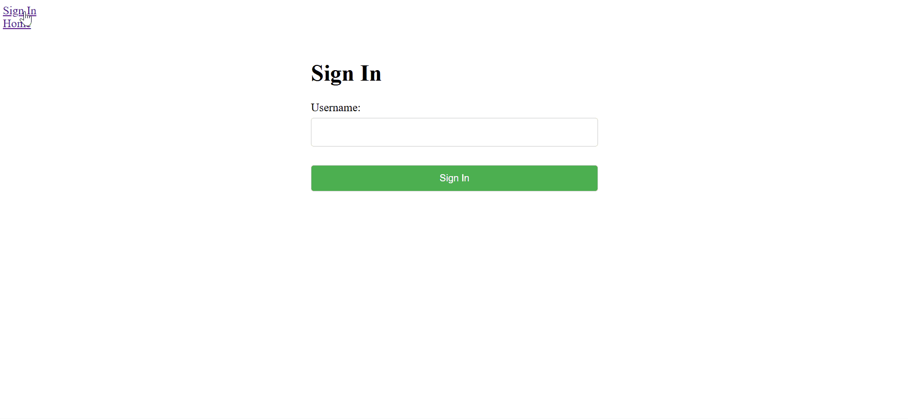
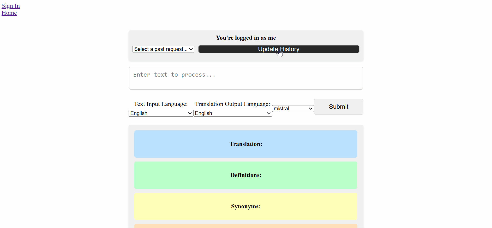
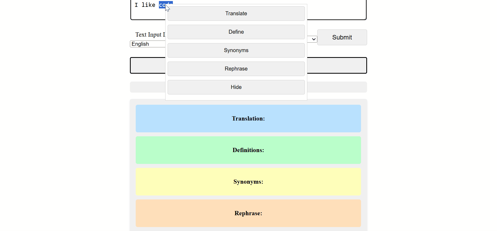
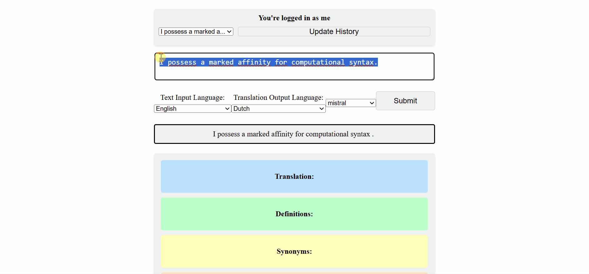

# Text Tutor: Getting Texts to Make Sense

This application provides a simple and intuitive user interface that helps understand a text by providing additional cues. Word-level cues like Part-of-Speech (ADJ, NOUN, VERB, etc.) or grammatical function (subj, obj, indirect obj, etc.) are invoked by default, while additional functionalities like translation (using GoogleTranslate) and rephrasing (using OLLaMa's mistral model) can be leveraged on demand.

## Overview
This is a **local-first application** designed to run on the user's machine.
It uses:
- Flask (backend)
- React (frontend)
- SQLite (local DB)
- Ollama (local LLM)

No cloud services required.

## Quick Start (Local)

1. **Clone:**

   git clone https://github.com/dominic-fischer/Text-Tutor.git
2. **Install Dependencies + Run:**

   cd Text-Tutor

   python main.py

Optional:
1. **Install Ollama:**

   https://ollama.com/download
2. **Pull a model:**

   ollama pull mistral

## Demo & Usage Instructions
### Logging in
Once the application is open in your browser, you can log in on the "Sign In" page or input a text on the "Home" page. Signing in means that your past requests will be saved in the database and can be retrieved quickly. 

### Default Informations
After copying or writing text into the input box, you can click the "Submit" button. This will process the text, which might take a few dozens of seconds. If you retrieved text from the database, processing will be skipped, as the information is saved.

A new box will then appear with the processed text. Upon hovering over individual words, grammatical information such as Part-of-Speech tags and grammatical function will be displayed.

### Word-Level Actions
Additional actions are performed via the context menu, which will appear upon selecting the desired text in the **input window** (in case it does not, it can be opened by right-clicking). For individual words, these actions include **Definitions** and **Synonyms**.

In order to close the context menu, hover over "Hide". The results of context-menu actions will appear in the corresponding boxes further below.

### Sentence-Level Actions
Furthermore, still with the context menu, **Rephrasing** and **Translation** can be performed on sentences or parts thereof.

